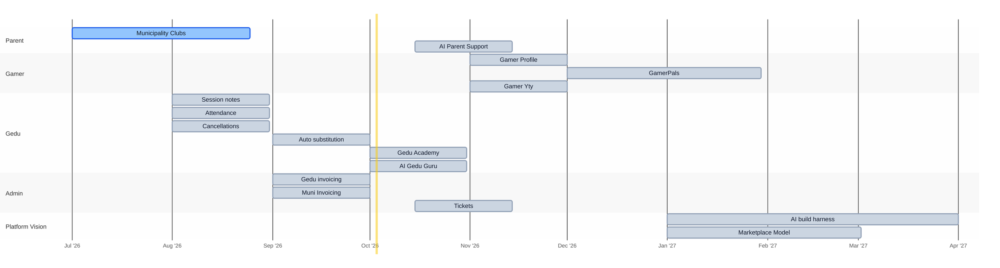

<strong>Last updated:</strong> 2026-06-29

# Sogverse Roadmap

The Sogverse planning and vision roadmap. Dream big, move fast, keep the customer experience at our core.

## Timeline

**Legend:** 🟩 Done · 🟦 In progress · ⬜ Planned

**Parent**
- **Municipality Clubs** — UX flow, parent registration window, seat count, and waitlist support for municipality-run clubs.
- **AI Parent Support** — Opt-in AI tooling to handle customer-service requests across email, WhatsApp, and the web-app chat — only when a parent consents.

**Gamer**
- **Gamer Profile** — Details about a gamer's preferences and interests.
- **GamerPals** — Find gamers with similar interests to make friends.
- **Gamer Yty** — Tracker where Gedus grant Yty elements and rewards, and gamers can see their progress.

**Gedu**
- **Session notes** — Parent-facing session notes, plus private Gedu and Admin session notes.
- **Attendance** — Gamer attendance tracking per session.
- **Cancellations** — Session cancellation by a Gedu.
- **Auto substitution** — When a Gedu cancels, a cover request goes out via WhatsApp, Discord, email, or in-app notification; an admin reviews the offers and approves a replacement.
- **Gedu Academy** — Sogverse system to recruit, train, and evaluate Gedus.
- **AI Gedu Guru** — AI bot that answers Gedu questions, brought natively into Sogverse (already running on Discord).

**Admin**
- **Gedu invoicing** — Calculate what Sogverse owes each Gedu based on the sessions they ran (session fees). CFO tooling.
- **Muni Invoicing** — Calculate what Sogverse charges each municipality based on negotiated session fees. CFO tooling.
- **Tickets** — Discord support tickets handled natively in Sogverse.

**Platform Vision**
- **AI build harness** — Long-term vision: an AI harness that lets any team member build, enabling them to integrate their own ideas and features into Sogverse.
- **Marketplace Model** — Independent Gedus are given tools to create content, products, and market themselves on the platform.
