# WhatsApp Business Automated Flow

## Overview

This document describes the automated conversation flow for the Sogverse WhatsApp business number. Contacts are greeted with a bilingual welcome, can interact with an AI assistant, and Gedus have access to a substitution request workflow.

## Flow Chart

> **Note:** After the initial bilingual welcome, all messages are sent in the language the user selected. Both Finnish and English versions are shown below for reference — the user only sees one.

```mermaid
flowchart TD
    Start([Contact starts new conversation])
    Welcome["Tervetuloa Sogverseen! 🌟
    Miten haluaisit asioida?
    ---
    Welcome to Sogverse! 🌟
    How would you like to be served?"]

    Start --> Welcome
    Welcome --> LangButtons{"WhatsApp Buttons
    Suomeksi / In English"}

    LangButtons --> BotGreeting["FI: Hei! Olen Sogversen tekoälyavustaja.
    Voin auttaa sinua kysymyksissäsi.
    Kirjoita /human milloin tahansa
    niin yhdistän sinut oikeaan henkilöön.
    ---
    EN: Hi! I'm the Sogverse AI assistant.
    I can help answer your questions.
    Type /human at any time
    to be connected to a real person."]

    BotGreeting --> AIChat[AI Assistant]

    AIChat -->|"User types /human"| HumanHandoff([Human agent takes over])

    %% Hidden /gedu path
    Start -..->|"User types /gedu
    (not advertised)"| GeduLang

    GeduLang{"WhatsApp Buttons
    Suomeksi / In English"}
    GeduLang --> GeduLookup["FI: Hei! Hetkinen, etsin tietojasi...
    EN: Hi! One moment, looking you up...
    (Lookup by phone number)"]

    GeduLookup --> GeduFound{"Gedu found?"}

    GeduFound -->|No| NotFound["FI: Emme valitettavasti löytäneet
    tiliä tällä numerolla.
    EN: Sorry, we couldn't find
    an account with this number."]

    GeduFound -->|Yes| GeduMenu["FI: Hei Anna! Miten voimme auttaa?
    EN: Hi Anna! How can we help?"]

    GeduMenu --> GeduOptions{"WhatsApp Buttons
    FI: Apua / Sijainen
    EN: Help / Substitute"}
    GeduOptions -->|"Apua / Help"| GeduGuru[Gedu Guru AI]
    GeduOptions -->|"Sijainen / Substitute"| SubJustification
    GeduOptions -.-|"(additional options
    can be added here)"| FutureOption[ ]

    GeduGuru -->|"Gedu types /human"| HumanHandoff

    %% Substitution flow
    SubJustification["WhatsApp Buttons
    FI: Miksi tarvitset sijaisen?
    EN: Why do you need a substitute?
    ─────────────
    • Sairaus / Illness
    • Henkilökohtainen syy / Personal reason
    • Muu syy / Other reason"]

    SubJustification --> ScheduleLookup["FI: Haetaan viikko-ohjelmaasi...
    EN: Looking up your weekly schedule..."]

    ScheduleLookup --> SessionSelect["WhatsApp List
    FI: Mille tunnille tarvitset sijaisen?
    EN: Which session do you need covered?
    ─────────────
    • Ma/Mon 15:00 – Minecraft Club
    • Ke/Wed 16:00 – Roblox Club
    • Pe/Fri 14:00 – Coding Club"]

    SessionSelect --> SubConfirm["FI: Sijaispyyntö lähetetty! ✅
    Ilmoitamme, kun sijainen löytyy.
    EN: Substitution request sent! ✅
    We'll notify you when a sub is found."]

    %% Notification fan-out
    SubConfirm --> AdminNotify["📋 ADMIN NOTIFICATION
    ─────────────
    Anna P. needs a substitute for
    Minecraft Club – Mon 15.4. at 15:00
    Reason: Illness
    ─────────────
    Eligible Gedus being contacted:
    Mikko L., Sanna R., Jari K."]

    SubConfirm --> EligibleNotify["📩 TO EACH ELIGIBLE GEDU
    (in their preferred language)
    ─────────────
    FI: Hei! Sijaistarve:
    Minecraft Club – Ma 15.4. klo 15:00
    EN: Hi! Substitute needed:
    Minecraft Club – Mon 15.4. at 15:00"]

    EligibleNotify --> EligibleResponse{"WhatsApp Buttons
    Gedu responds"}
    EligibleResponse -->|"❌ Ei kiitos / Decline"| Declined[No further action]
    EligibleResponse -->|"✅ Voin tulla / I can cover"| AdminAlert["📋 ADMIN NOTIFICATION
    ─────────────
    Mikko L. confirmed availability!
    Select as replacement?"]

    AdminAlert --> AdminDecision{"WhatsApp Buttons
    Admin action"}
    AdminDecision -->|"Wait for more"| WaitMore[Wait for more confirmations]
    AdminDecision -->|"Select"| Selected["FI: Sinut on valittu sijaiseksi! 🎉
    EN: You've been selected as substitute! 🎉
    (Human takes over conversation)"]

    Selected -.->|"To other Gedus
    who confirmed but
    were not selected"| OthersNotified["FI: Kiitos kiinnostuksestasi!
    Sijaisuus on jo täytetty.
    EN: Thanks for your interest!
    The spot has already been filled."]

    %% Legend
    subgraph Legend
        direction LR
        L1{"WhatsApp Buttons"}:::waBtn ~~~ L2["WhatsApp List"]:::waList ~~~ L3["Bot message"]
    end

    %% WhatsApp interactive UI styles
    style LangButtons fill:#0b7dda,color:#fff,stroke:#0b7dda
    style GeduLang fill:#0b7dda,color:#fff,stroke:#0b7dda
    style GeduOptions fill:#0b7dda,color:#fff,stroke:#0b7dda
    style SubJustification fill:#0b7dda,color:#fff,stroke:#0b7dda
    style EligibleResponse fill:#0b7dda,color:#fff,stroke:#0b7dda
    style AdminDecision fill:#0b7dda,color:#fff,stroke:#0b7dda
    style SessionSelect fill:#17a84b,color:#fff,stroke:#17a84b

    %% Other styling
    style Start fill:#25D366,color:#fff
    style HumanHandoff fill:#8F00E2,color:#fff
    style SubConfirm fill:#FAA901,color:#000
    style Selected fill:#FAA901,color:#000
    style NotFound fill:#e74c3c,color:#fff
    style FutureOption fill:#95a5a6,color:#fff,stroke-dasharray: 5 5

    classDef waBtn fill:#0b7dda,color:#fff,stroke:#0b7dda
    classDef waList fill:#17a84b,color:#fff,stroke:#17a84b
```

## Path Summary

| Path | Trigger | Description |
|------|---------|-------------|
| **Parent/Public** | New conversation | Bilingual welcome, AI assistant, `/human` for live agent |
| **Gedu** | `/gedu` command | Phone lookup, Help (Gedu Guru AI) or Substitute request |
| **Substitution** | Gedu selects "Substitute" | Justification -> schedule -> session select -> fan-out to admins & eligible Gedus |
| **Replacement selection** | Admin selects a confirmed Gedu | Selected Gedu notified + human handover; others thanked |
